# Blue/Green Deployment with AWS

This repository is a minimal example of a **blue/green deployment** setup on AWS using a pair of web pages (blue + green), an **Application Load Balancer (ALB) listener** and a small **AWS Lambda** function that can shift traffic between the **Blue** and **Green** target groups.

---

## Contents

1. What’s in this project
2. Architecture overview
3. Files in the repository
4. Deployment/usage steps (documented end-to-end)
5. Lambda details (traffic shifting)
6. Screenshots 
7. Troubleshooting
8. Security notes

---

##  What’s in this project

- **Two static HTML pages**:
  - `index-blue.html` (blue version)
  - `index-green.html` (green version)
- **A Lambda function** (`lambdafunction`) that updates the ALB listener to route traffic:
  - 100% to **Blue** (rollback)
  - 0% to **Green**
  - (and can be adapted to shift other percentages)
- **Amazon EventBridge** (event automation): triggers the rollback workflow by invoking the Lambda when health alarms indicate failure.

> Note: This repo shows the application + control logic. The ALB, target groups, and listener must already exist in your AWS account (or be created following similar AWS console/CLI steps).

---

##  Architecture overview

At a high level:

1. An **ALB listener** forwards requests to two target groups:
   - `bluetargetg`
   - `greentargetg`
2. ALB routing is controlled by **listener forward rules** with weights.
3. The **Lambda function** calls `elbv2.modify_listener()` to update the listener’s `ForwardConfig`.
4. By changing weights, traffic can be shifted between blue and green.

---

## 3) Files in the repository

### `index-blue.html`
Blue environment landing page.

### `index-green.html`
Green environment landing page.

### `lambdafunction`
Python code for an AWS Lambda function that modifies the ALB listener to route traffic.

---

##  Deployment / Usage Steps 

> Capstone expectation: document **planned steps vs observed behavior**, include **validation first** and show **safe traffic switching + automated rollback readiness**.

###

1. Launched **Blue** web-tier instances (EC2 behind ALB).
2. Launched **Green** web-tier instances (same configuration/AMI/security groups/networking).
3. Configured ALB target groups:
   - Target group for **Blue**
   - Target group for **Green**
4. Attached routing so production can be switched between the two target groups.

 Expected result:
- Blue and Green have target groups configured in the ALB.

- **Screenshot 1:** ALB + target group configuration showing Blue and Green target groups.

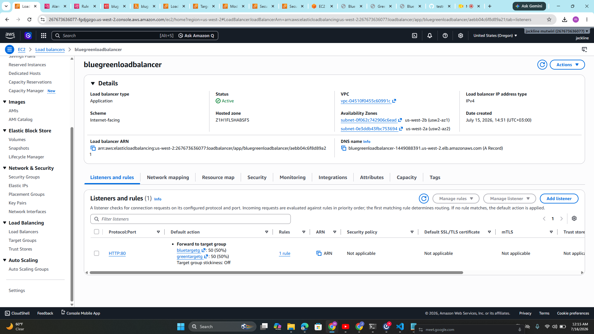

---

###  Deploy the new version to Green (validation first)
1. Deployed my updated web-tier version (the “new release”) to **Green** instances.
2. Ensured environment parity with Blue:
   - same ports
   - same app dependencies
   - same configuration style
3. Run **smoke tests** on Green (examples):
   - HTTP GET returns 200
   - critical endpoint returned expected payload
   - validated startup logs for errors and successful service binding
4. Confirmed application responsiveness under a small burst of real traffic (if possible) to validate behavior, not only health endpoints.

Expected result:
- Green is responding correctly and is safe to promote.

 
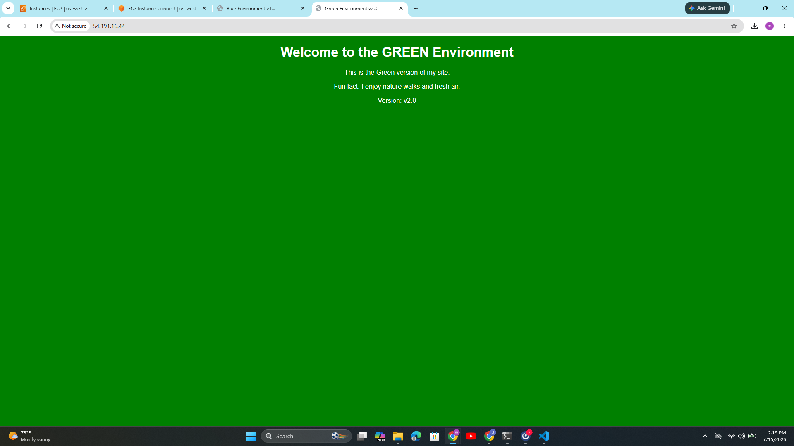

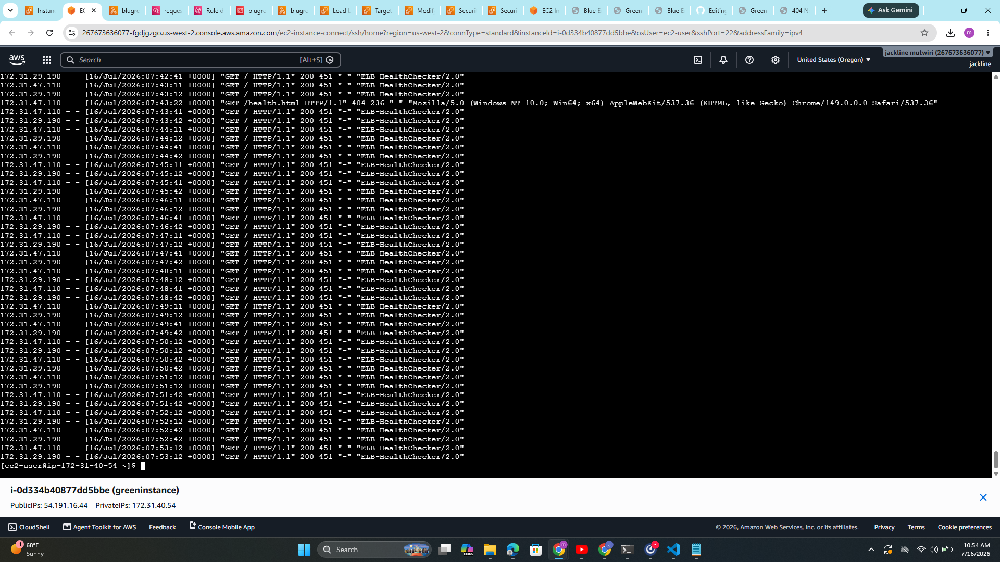

---

###  Configure Health Check on Green
- Configured ALB target group health check for Green.
- Protocol: HTTP
- Path: /health.html
- Expected response: 200 OK
- Verified Green targets transitioned to Healthy.

Expected result:
- Green targets transition from initial to **Healthy**.

 
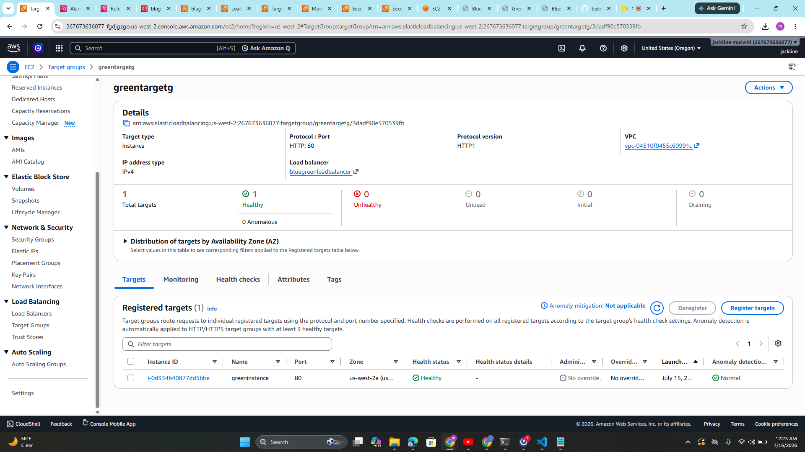

---

### Switch Traffic Safely
- Updated ALB listener forwarding to gradually shift traffic from Blue to Green.
- Started with 10% Green, then increased to 50%, before moving to 100%.
- Monitored application behavior during each shift.
Expected result:
- Some traffic is routed to Green, while Blue still serves the majority (until confirmed stable).

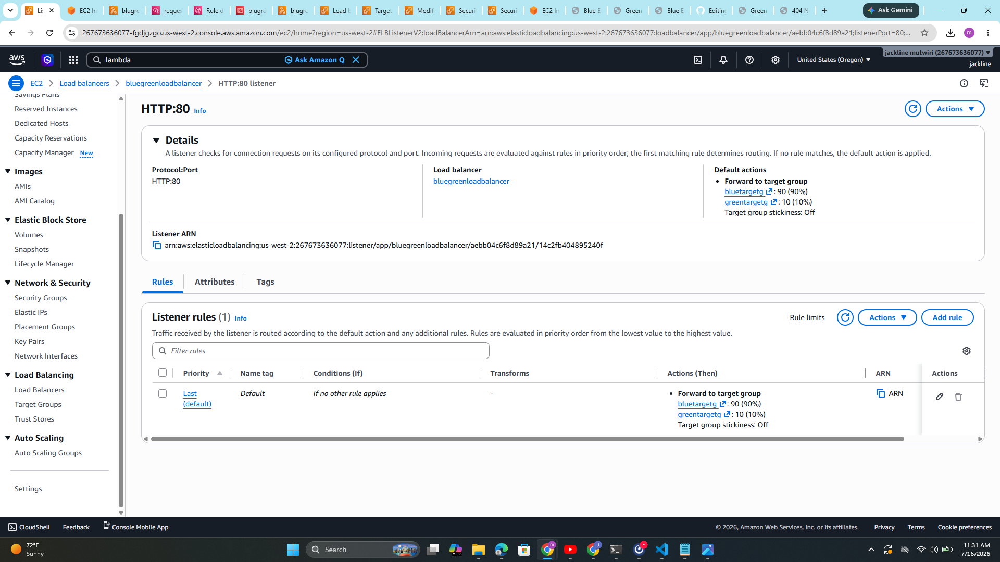
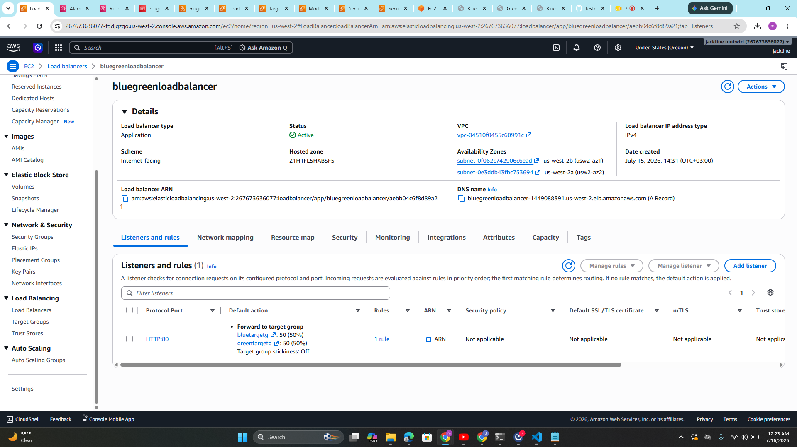
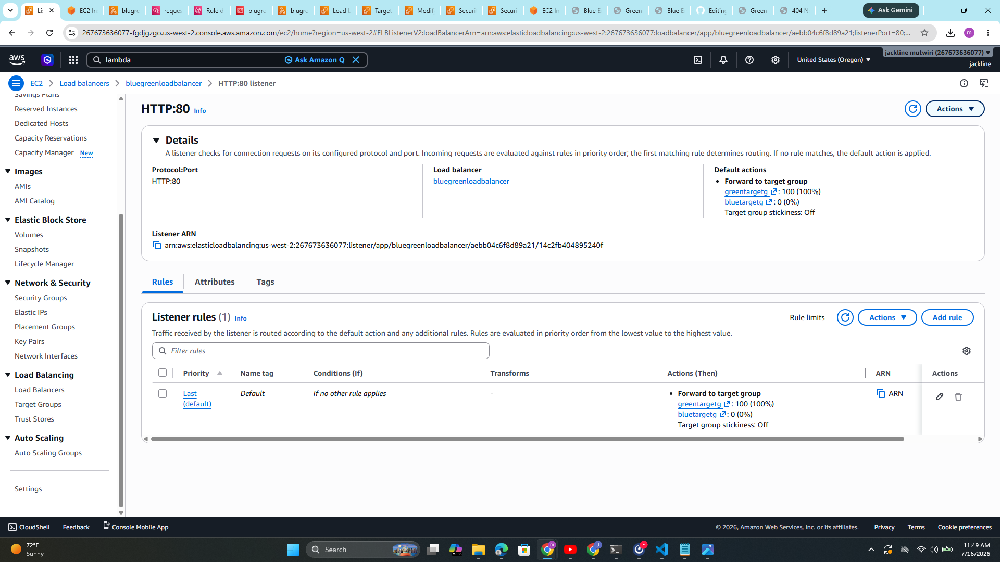
---

### Monitor with CloudWatch Metrics + Alarms
- Configured CloudWatch alarms to monitor Green environment health:
  - **HTTP 5xx rate/count** – detects runtime/application failures.
  - **Latency/response time** – rising latency indicates saturation.
  - **requestcount**
  - **UnHealthyHostCount** – ensures targets remain healthy.
- Observed alarms during traffic ramp (10% → 50% → 100%).
- Expected result: alarms remained in **OK** state during rollout.
- Verified rollback by triggering an alarm (ALARM state).

 Expected result:
- No alarm triggers during planned ramp steps.
- If alarms do trigger, rollback is fast and verified.

Screenshot to add:
- **Screenshot 6:** CloudWatch alarms timeline (showing OK during Green ramp or ALARM triggering in rollback test).
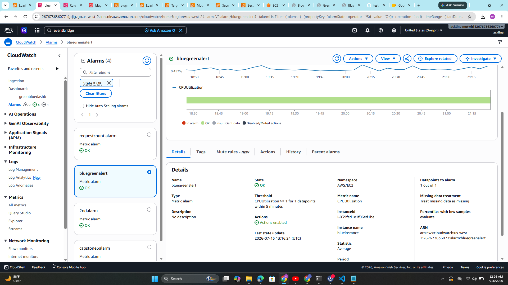
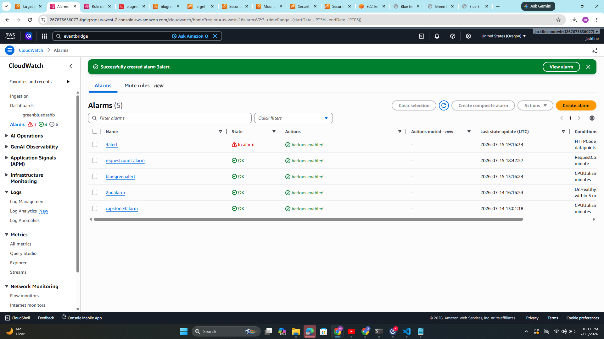
---

 ###  Validate After Traffic Switch
- Confirmed ALB listener forwards 100% traffic to Green.
- Loaded application homepage and verified new version (v2.0).
- Critical API endpoints responded successfully.
- No errors observed during full traffic switch.
 Expected result:
- Users see the new Green version without errors.

---

### Automated Rollback if Green Fails
- Simulated failure by forcing Green targets into unhealthy state.
- ALB listener automatically switched traffic back to Blue.
- Verified CloudWatch alarms returned to **OK** after rollback.
- Confirmed Blue homepage served correctly.

 Expected result:
- Rollback switches traffic back to Blue quickly and metrics normalize.

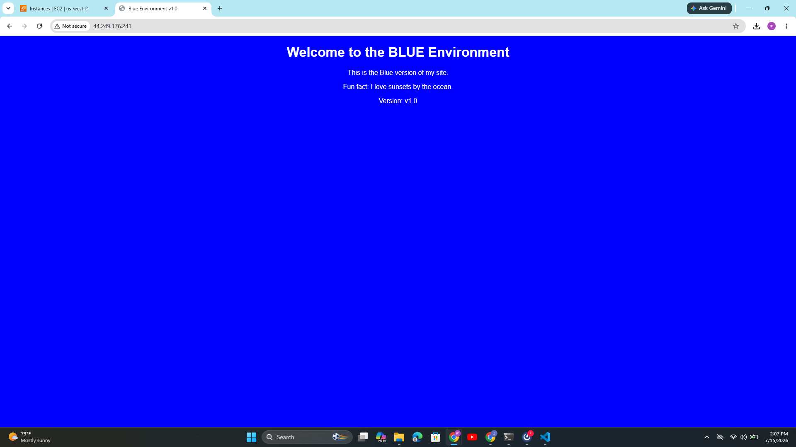
  
---

##  How this repo’s Lambda fits in the traffic switch
- Implemented a Lambda function (`blugreenrollback`) to automate rollback.
- Function calls `elbv2.modify_listener()` to reset traffic weights:
  - Blue weight = 100
  - Green weight = 0
- Tested rollback by simulating Green failure.
- Lambda executed successfully and restored traffic to Blue.
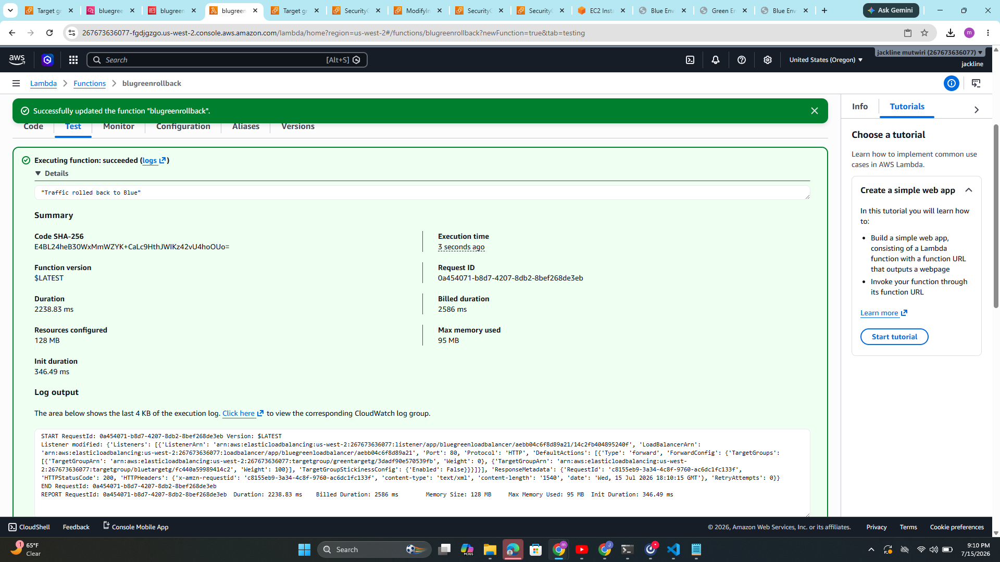

## Lambda details (traffic shifting)

The Lambda function:

- Creates an ELBv2 client via `boto3.client('elbv2')`
- Calls:
  - `client.modify_listener(ListenerArn=..., DefaultActions=[...])`
- Uses `ForwardConfig` with `TargetGroups` weights

## EventBridge Integration
- Configured EventBridge rule to capture S3 object creation events.
- Rule forwards events to Lambda function.
- Lambda processes event payload automatically.
- Verified execution in CloudWatch Logs.

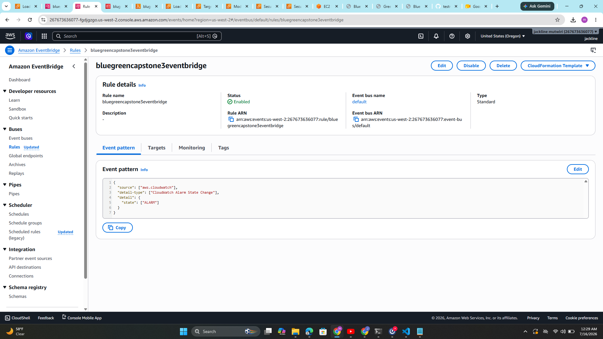

 **Troubleshooting**

- Insufficient data in CloudWatch alarms → send traffic to ALB and wait for evaluation period.
- Rollback validation → confirm Blue homepage loads after traffic switch.

## Appendix: summary

- Deployed blue and green versions to their respective target groups.
- Deployed new version to Green.
- Validated environment parity and health.
- Configured ALB listener for weighted traffic.
- Monitored with CloudWatch alarms.
- Validated full traffic switch to Green.
- Automated rollback tested with Lambda.